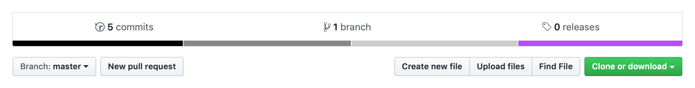

# Asexual Pride in GitHub Repository Languages



## Testing the programs

They all print a joke about asexuals:

*   `stripe-1.cr` was tested in [the Crystal playground](https://play.crystal-lang.org/#/r/6oia).

*   `stripe-2.php` can be tested using the HHVM Docker image.

    ```console
    $ docker run --volume $(pwd):/var/www/public --publish 8080:80 hhvm/hhvm-proxygen:latest
    $ curl http://localhost:8080
    ```

*   `stripe-3.tf` can be tested using the Terraform Docker image:

    ```console
    $ docker run --volume $(pwd):/src --workdir /src hashicorp/terraform:light apply
    ```

*   `stripe-4.fs` was tested in an interactive session with the [F# Docker image](https://github.com/fsprojects/docker-fsharp).

## Prior art

Idea shamelessly copied from [spacekookie/gay](https://github.com/spacekookie/gay) (rainbow pride flag) and [ticky/trans](https://github.com/ticky/trans) (trans pride flag).

## Useful resources

[ozh/github-colors](https://github.com/ozh/github-colors), for finding appropriate languages for each colour.
